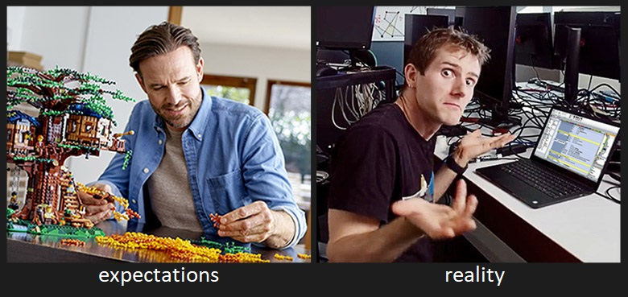

# 🧱 Board game constructor

User friendly engine for creating custom board games



## Features

* Defining a game by JSON file
* File structure is designed to be easy-readable yet flexible
* Rich board defining possibilities
* Supports defining complex moves like castling and *en passant*
* Integrated state machine for game states handling

## Config file structure description

Root structure is key-value. Fields are (descriptions separated by horizontal lines):

`name` -- game name

```json
"name": "intellector"
```


---


`players` -- list of players names

```json
"players": ["white", "black"]
```


---


`cell` -- object that defines cells space and how to display them


---


`cell.coordinates_names` -- names of dimensions of space where cells are located


---


`cell.geometry` -- list of (x, y)-points, defines polygon that is drawn as cell

```json
"geometry": [
	[0.9,	0.39],
	[0.675,	0.78],
	[0.225,	0.78],
	[0,		0.39],
	[0.225,	0],
	[0.675,	0]
]
```


---


`cell.position` -- object that defines how cell screen coordinates are calculated, each coordinate defined by JavaScript expression

```json
"position": {
	"x": "x * 0.675",
	"y": "(y + x / 2) * 0.78"
}
```


---


`cell.colors` -- object that defines cells colors, each color defined by JavaScript expression

```json
"colors": {
	"fill": "((!(x % 3) && !((x + y) % 3)) || (!((x + 1) % 3) && !((x + y + 2) % 3)) || (!((x + 2) % 3) && !((x + y + 1) % 3))) ? 'grey' : 'white'"
}
```


---


`board` -- object that defines which cells are in board and how to rotate board accordingly to current move's player

```json
"board": {
	"rotation_angle": {
		"white": 180,
		"black": 0
	},
	"cells": [
		{"x": 0, "y": 0},
		{"x": 0, "y": 1},
		{"x": 0, "y": 2},
        ...
	]
}
```


---


`figures` -- object that defines how figures can action

```json
"figures": {
    "intellector": {...},
    "defensor": {...},
    ...
}
```


---


`figures.some_figure_name` -- object that defines how `some_figure_name` can action

```json
"intellector": {
    "movement": [{...}, {...}, ...],
    "cell_actions": {...}
}
```


---


`figures.some_figure_name.movement` -- list of available *movements*

```json
"movement": [{
    "x": 1,
    "also_reversed": true
}, {
    "y": 1,
    "also_reversed": true
}]
```


---


`figures.some_figure_name.movement[]` -- *movement* description

* keys which are dimensions names (`"x"`, `"y"` for example), describes move coordinates delta
* `cell_actions` is an object that describes *actions sets*, which should be done if move fits coordinates delta
* *actions set* can be of type `destination` or `transition`
* `destination` means that *action* processed for destination cell
* `transition` means that *action set* processed for cells that the figure should *transit* in order to reach destination
* cell treats as *transition* for some *action set* if figure can reach it using this and only this *action set*'s coordinates delta

```json
{
    "y": 2,
    "cell_actions": {
        "destination": [{
            "actions": ["move"],
            "if": [{
                "self": {
                    "moves_made": 0
                },
                "computed": {
                    "is_figure": false
                }
            }]
        }],
        "transition": [{
            "actions": ["cancel"],
            "if": [{
                "computed": {
                    "is_figure": true
                }
            }, {
                "computed": {
                    "is_cell": false
                }
            }]
        }]
    }
}
```

*actions* are executed consequentially, as they defined in `actions` list.

Available *actions* are:

* `move` -- sets target cell figure to source cell figure, then clears source cell
* `take` -- clears target cell
* `swap` -- swaps target cell figure with source cell figure
* `cancel` -- cancels move

*Conditions sets* for each *actions set* can be provided, defined as list by key `if`

* *actions set* is executed if one or more *conditions set* are true
* *conditions set* considered true if all *conditions* are true
* *conditions* divided into 3 categories: `self`, `target` and `computed`
* `self` *conditions* are an object, which should *match* source *cell object* for the *condition* to be considered true
* `target` *conditions* are an object, which should *match* target *cell object* for the *condition* to be considered true
* *match* means, in simple words, that *conditions* are a part of target object (for the curious: of course, it supports nesting (that is, the so-called deep match))
* `computed` conditions are object which keys are built-in functions names and values are values that this functions should return

*cell object* always have the following properties:

* properties with names of dimensions and values of coordinates (`"x": 1` for example)

If an figure located on the cell, *cell object* also have the following properties:

* `figure` -- name of figure that is located on this cell
* `player` -- name of player to which belongs this figure
* `moves_made` -- amount of moves made by this figure

`cell_actions` can be defined both into `figures.some_figure_name` (*global*) and `figures.some_figure_name.movement[]` (*action-specific*). They are merged when it comes to deal with concrete *movement*.


---


`complex_movement` -- list of *complex movements*

*complex movement* is an object that can have the following properties:

* `figures` -- list of *movements*, where each *movement* supplemented by properties `figure` (figure name) and `relative_position` (object like `{"x": 1}`)
* `cell_actions` -- described in the end of the section above

```json
"complex_movement": [{
    "figures": [{
        "figure": "king",
        "coordinates_delta": {
            "x": -2
        }
    }, {
        "figure": "rook",
        "relative_position": {
            "x": -3
        },
        "coordinates_delta": {
            "x": 2
        }
    }],
    "cell_actions": {
        "destination": [{
            "actions": ["move"],
            "if": [{
                "self": {
                    "moves_made": 0
                },
                "computed": {
                    "is_figure": false
                }
            }]
        }]
    }
}
```

*complex movements* are checked if no of the "simple" *movements* fit.


---


`resources` -- resources for game (currently only figures images links)

```json
"resources": {
    "images": {
        "figures": {
            "white": {
                "king": "https://upload.wikimedia.org/wikipedia/commons/4/42/Chess_klt45.svg",
                "queen": "https://upload.wikimedia.org/wikipedia/commons/1/15/Chess_qlt45.svg",
                "rook": "https://upload.wikimedia.org/wikipedia/commons/7/72/Chess_rlt45.svg",
                "bishop": "https://upload.wikimedia.org/wikipedia/commons/b/b1/Chess_blt45.svg",
                "knight": "https://upload.wikimedia.org/wikipedia/commons/7/70/Chess_nlt45.svg",
                "pawn": "https://upload.wikimedia.org/wikipedia/commons/4/45/Chess_plt45.svg"
            },
            "black": {
                "king": "https://upload.wikimedia.org/wikipedia/commons/f/f0/Chess_kdt45.svg",
                "queen": "https://upload.wikimedia.org/wikipedia/commons/4/47/Chess_qdt45.svg",
                "rook": "https://upload.wikimedia.org/wikipedia/commons/f/ff/Chess_rdt45.svg",
                "bishop": "https://upload.wikimedia.org/wikipedia/commons/9/98/Chess_bdt45.svg",
                "knight": "https://upload.wikimedia.org/wikipedia/commons/e/ef/Chess_ndt45.svg",
                "pawn": "https://upload.wikimedia.org/wikipedia/commons/c/c7/Chess_pdt45.svg"
            }
        }
    }
}
```


---


`win_conditions` -- an object that defines win conditions for each player separately

* keys are players names
* values are lists of *filter-check conditions*
* win conditions for player considered true if one or more *filter-check condition* considered true

*filter-check condition* is consists of 4 properties:

* `entity` -- entities type to filter (currently only `cell` type available)
* `filter` -- object to *match* entity to it to pass filter
* `type` -- check function name (currently only `exists` function available)
* `result` -- the result the function should return to *filter-check condition* to be considered true

```json
"win_conditions": {
    "white": [{
        "entity": "cell",
        "filter": {
            "player": "black",
            "figure": "king"
        },
        "type": "exists",
        "result": false
    }],
    "black": [{
        "entity": "cell",
        "filter": {
            "player": "white",
            "figure": "king"
        },
        "type": "exists",
        "result": false
    }]
}
```


---


`game_states` -- an object that describes game states and transitions between them

* keys are game states names
* values are game states descriptions

```json
"game_states": {
    "white_move": {
        "type": "move",
        "parameters": {
            "player": "white"
        },
        "next": "check_white_win"
    },
    "black_move": {
        "type": "move",
        "parameters": {
            "player": "black"
        },
        "next": "check_black_win"
    },
    "check_white_win": {
        "type": "check_win",
        "parameters": {
            "player": "white"
        },
        "next": [{
            "state": "black_move",
            "if": [{
                "result": false
            }]
        }, {
            "state": "white_won",
            "if": [{
                "result": true
            }]
        }]
    },
    ...
}
```

* each game state have `type`
* all game states except those of type `end` have property `next`
* some game states have `parameters`

Available game state types and corresponding parameters are:

* `move` -- when player `parameters.player` should make a move
* `check_win` -- when computer should check if player `parameters.player` won
* `next_move` -- when computer should increase current move number (for example, in chess `next_move` triggered after black moved)
* `end` -- when game end

Property `next` is a list that defines which state and under what conditions will be next

* `next[].state` -- name of next state
* `next[].if` -- conditions; processed just like conditions for movements


---


`initial_game_state` -- name of initial game state

```json
"initial_game_state": "white_move"
```